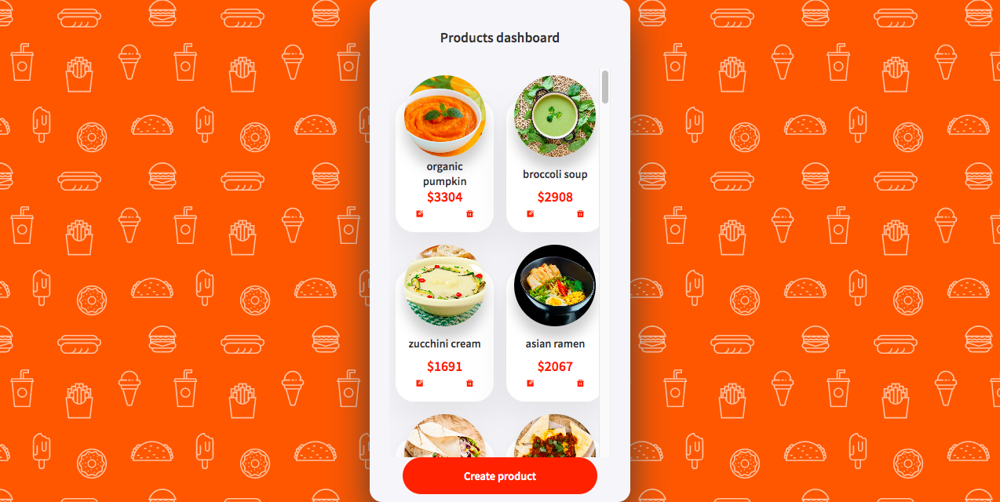
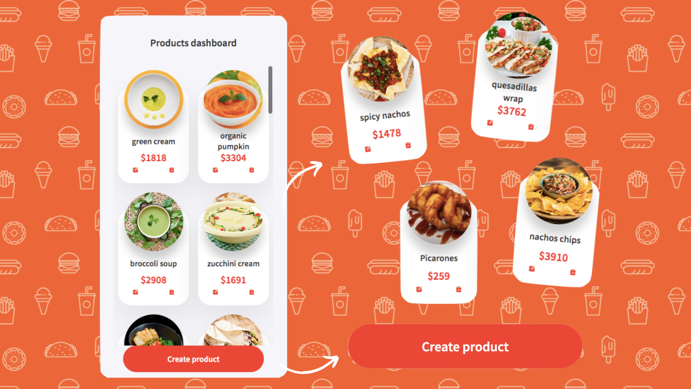
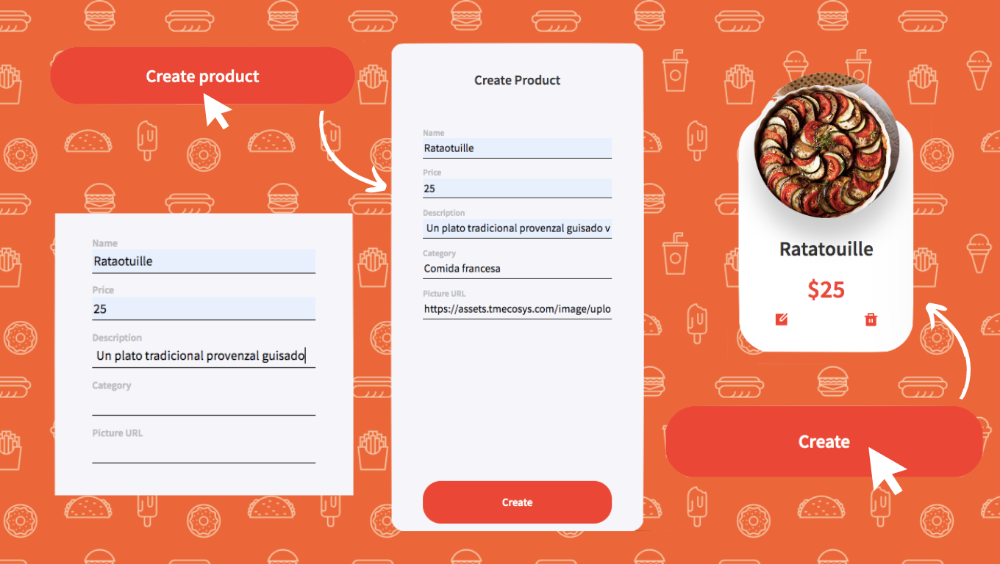
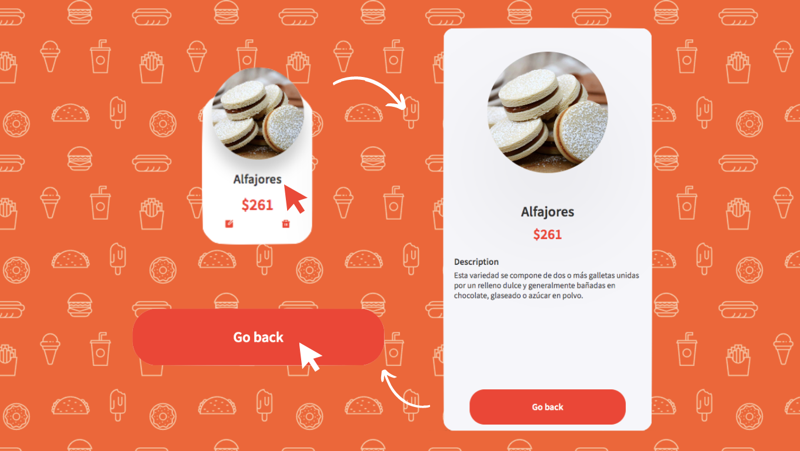
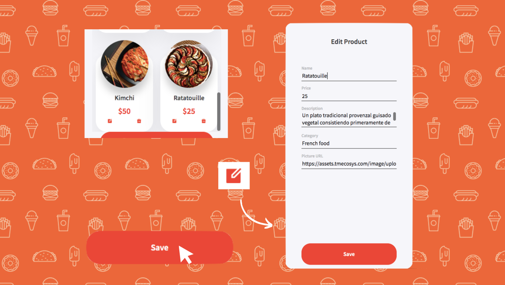
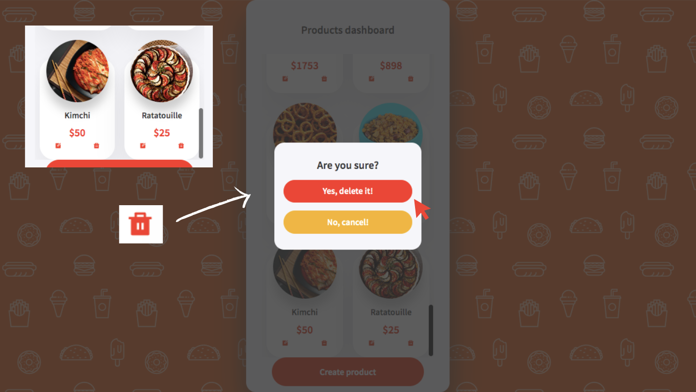

# Eatable

ProductS Dashboard of Eatable, an application where you can buy food.
## Table of contents

- [Getting Started](#getting-started)
  - [Built with](#built-with)
  - [Installation](#installation)
- [Overview](#overview)
  - [Screenshot](#screenshot)
  - [Links](#links)
- [How to use](#how-to-use)
  - [Home](#home)
  - [Create product](#create-product)
  - [View product](#view-product)
  - [Edit product](#edit-product)
  - [Delete product](#delete-product)

## Getting Started
### Built with


- JavaScript
- React
- Emotion

### Installation
Run the following commands:
```
npm install
```
Running the app
```
npm start
```
To view it open http://localhost:3000

## Overview
### Screenshot


### Links
- Live Site URL: [Eatable](https://eatable-fg.vercel.app)

## How to use
### Home
You will see Eatable's home page, here you can found a button to create products and the diferents products, with their prices and options.


### Create product
To create a product click the button "Create product".

Now you are in "Create" page, fill product details and save it clicking the "Create" button.

Remember, you must use the link of an image for your product.


### View product
To view the details of a product, click on its name.

Now you are in "Product details" page, here you will see product's name, image, price and description.

Click on the "Go back" button to return to the home page.


### Edit product
To edit a product, click on its pencil button.

Now you are in "Edit product" page, update the product details and click on "Save" button.


### Delete product
Finally to delete a product, click on its trash button. You will see a modal to confirm the deletion.

